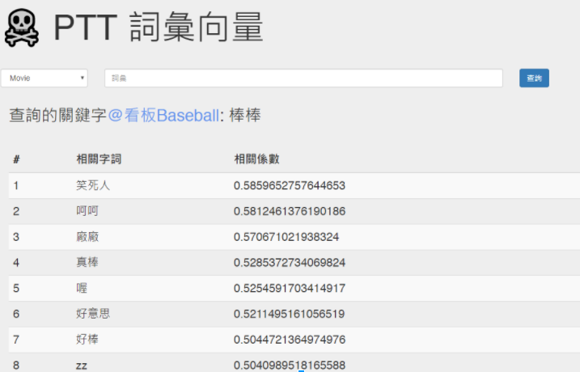
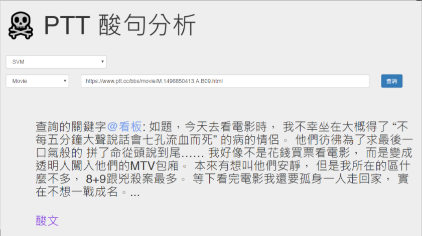

# PTT 酸文分類

No sour posts anymore :crystal_ball:

- Our UI for word2vec

    

- Our UI for classifier

    

## Dependency

- MongoDB
- Python 3.5+

## Reqirement
- pymongo

- For word2vec
    - jieba
    - gensim
    p.s. Need to prepare your own `data/dict.txt.big` and `data/stop_words.txt`

- For demo app
    - flask
    - click

## Models

- TF-IDF-based NaiveBayesian/SVM model from [meegoStar/trolling_detector](https://github.com/meegoStar/trolling_detector/)
- word2vec-based LSTM model from [shunhuaiyao/bitter_sentence_detector](https://github.com/shunhuaiyao/bitter_sentence_detector/)
